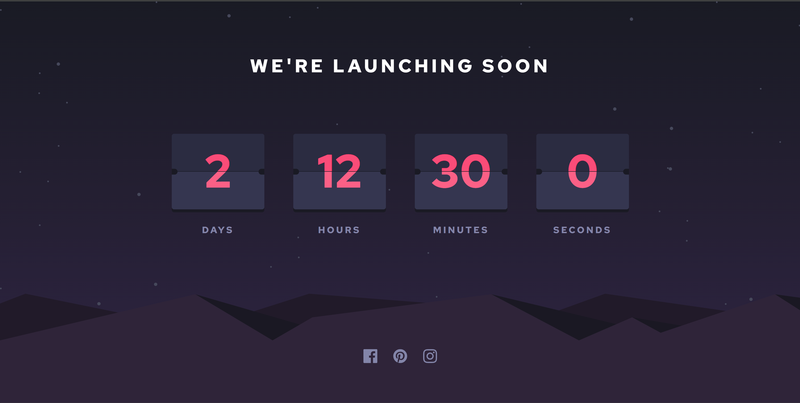

# Frontend Mentor - Launch countdown timer solution

This is a solution to
the [Launch countdown timer challenge on Frontend Mentor](https://www.frontendmentor.io/challenges/launch-countdown-timer-N0XkGfyz-).
Frontend Mentor challenges help you improve your coding skills by building realistic projects.

## Table of contents

- [The challenge](#the-challenge)
    - [Screenshot](#screenshot)
    - [Links](#links)
    - [Built with](#built-with)
- [Author](#author)

### The challenge

Users should be able to:

- See hover states for all interactive elements on the page
- See a live countdown timer that ticks down every second (start the count at 14 days)
- **Bonus**: When a number changes, make the card flip from the middle

### Screenshot

### Links

- Solution URL: [GitHub Solution URL](https://github.com/apodgornyitba/Countdown)
- Live Site URL: [GItHub Pages URL](https://apodgornyitba.github.io/Countdown/)

### Built with

- [React](https://reactjs.org/) - JS library
- [Next.js](https://nextjs.org/) - React framework
- [Node.js](https://nodejs.org/) - JS runtime environment

## Author

- Website - [Andres Podgorny](https://github.com/apodgornyitba)
- Frontend Mentor - [@apodgornyitba](https://www.frontendmentor.io/profile/apodgornyitba)
- Twitter - [@PodgornyAndres](https://twitter.com/PodgornyAndres)